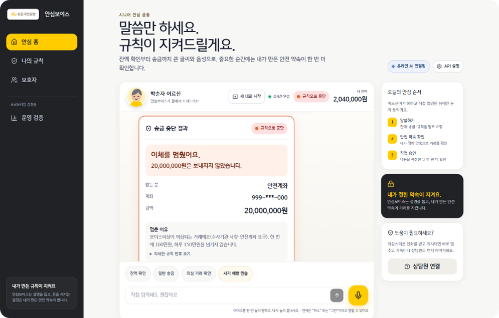
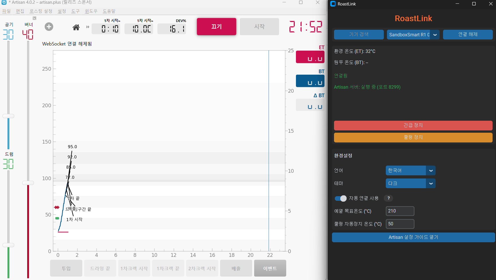
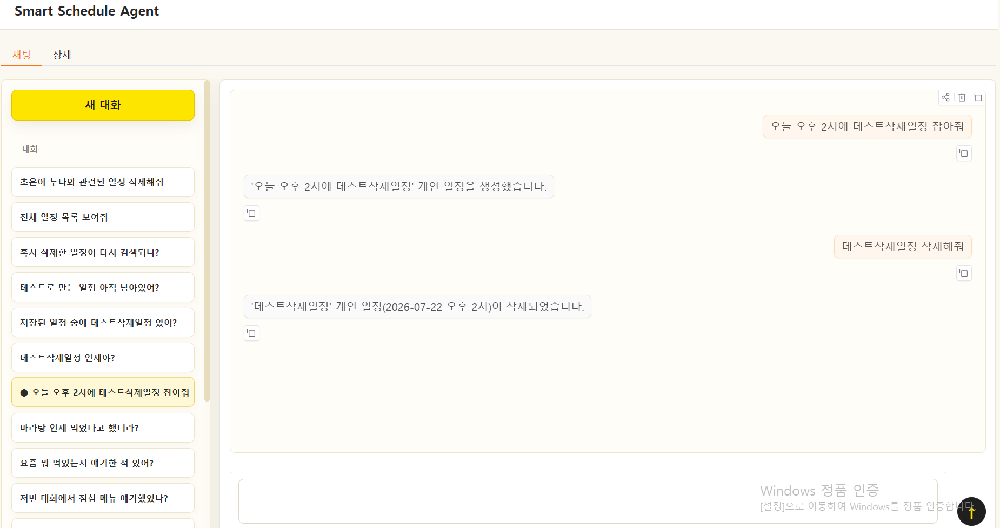

# 김민재 · Coffee_Driven_Dev

### AI를 실제 서비스에 붙이는 백엔드 · 웹 개발자를 목표로 합니다

충남대학교 컴퓨터공학과 4학년

> 🇰🇷 한국어 | [🇺🇸 English](./README_EN.md) *(준비 중)*

 

---

## About Me

백엔드와 웹 서비스를 만드는 것을 기본기로 삼고, 여기에 AI/ML을 붙여 실제로 동작하는 제품을 만드는 데 관심이 있습니다.
온디바이스 AI 경량화, 서버-클라이언트 간 추론 책임 분리, 데이터베이스 계층에서의 무결성 보장을 직접 구현하며 배우고 있습니다.

개발할 때 아래 기준을 지키려 합니다.

- **AI는 기능이 아니라 서비스의 일부로 통합하기** — 추론을 어디서 실행할지, 실패하면 무엇을 보장할지부터 설계
- **DB·서버 계층에서 무결성을 보장하기** — 애플리케이션 로직만이 아니라 제약·트랜잭션·격리 수준으로도 지키기
- **궁금한 내용은 끝까지 알아내기** — 동작 원리를 이해하지 못한 코드는 남기지 않기

### Currently Working On

- **브릿지 프로그램 운영 중** - 자세한 내용은 아래 RoastLink 프로젝트 참고
- **Kakao Tech Campus** — Kakao가 주최하는 부트캠프로 프론트엔드/백엔드/AI Agent 설계/프로젝트의 기획부터 배포까지의 전 과정을 학습 중입니다.
- On-Device AI를 활용한 보안에 문제 없이 **검색 가능한 갤러리** 개발 프로젝트 진행 중

---

## 거름이 된 실패에 대하여

프로젝트를 소개하기 전에, 머지되지 못한 PR 하나를 먼저 이야기하고 싶습니다.

GitHub 스타 1만 개, Microsoft Store에 배포되는 C# 데스크톱 앱 **RunCat365**에 다국어 지원(i18n) 구조를 도입하는 PR을 냈습니다. — 이슈 [#225](https://github.com/runcat-dev/RunCat365/issues/225), PR [#255](https://github.com/runcat-dev/RunCat365/pull/255) · 9개 파일 · **+605 / −45**

앱 곳곳에 영어로 박혀 있던 UI 문자열을 리소스 파일로 빼내 어떤 언어든 추가할 수 있게 만드는 작업이었습니다. 그 과정에서 **표시 텍스트와 아이콘 리소스 키를 같은 함수(`GetString()`)가 겸하고 있다는 걸 발견**했고, 텍스트를 한국어로 바꾸자 아이콘 키까지 오염돼 앱의 핵심인 애니메이션이 멈추는 버그를 만났습니다. 표시용(`GetString`)과 식별자용(`GetResourceName`) 접근자를 분리해 해결하고, 리소스 조회가 실패해도 앱이 죽지 않도록 기본 아이콘 폴백을 더했습니다.

하지만 원작자에게 **"문구가 호출 지점마다 흩어져 있어 중앙에서 관리할 구조가 필요하다"**는 리뷰를 받았습니다. 실제로 제 코드에는 라벨 하나가 누락돼 있었지만 저는 그것을 발견도 못했었습니다. 원작자가 이후 "다국어 지원 기반은 마련됐으니, 계속할 의향이 있으면 리베이스해서 진행해달라"고 남겼지만 제때 응답하지 못했고, PR은 결국 머지되지 못한 채 닫혔습니다. 한국어 지원은 그 뒤 다른 기여자의 PR([#312](https://github.com/runcat-dev/RunCat365/pull/312))로 해결됐습니다. 그래도 저는 **"변하는 값은 한 곳에서 통제해야 한다"**는 원칙을 제 코드로 체득했습니다.

> 이 깨달음은 이후 온디바이스 앱의 다국어를 만들 때, ko·en·zh·ja 네 언어의 번역을 단일 맵(`app_translations.dart`)에 모으고 UI는 키로만 조회하는 중앙 관리형 구조로 이어졌습니다.

---

# Projects

## 1. Seoul Landmark Assistant — 온디바이스 AI 랜드마크 인식 앱

2026.01 ~ 2026.07 · 팀 프로젝트 · 담당: 백엔드, 모델 통합

<!-- 대표 화면 1장 -->

  
  

- **네트워크가 끊긴 상황에서도 인식이 동작해야 해서** 추론을 서버가 아닌 단말에 두고, 서버는 인증·제보·검색 로그·통계만 담당하도록 책임을 분리했습니다.
- **MobileCLIP2-S3 FP16 모델을 ONNX Runtime으로 단말에서 실행**하여 25개 서울 랜드마크(궁궐 세부 건물 포함)를 분류합니다.
- **중복 로그인 방지를 위해 "1기기 1계정" 정책**을 적용해, 새 기기에서 로그인하면 기존 푸시 토큰을 무효화하도록 FCM 등록 로직을 구성했습니다.
- 검색 로그에 모델 버전 · 추론 백엔드 · Top-3 스코어 · 지연시간(latency)을 함께 기록해, 배포 후에도 인식 품질을 추적할 수 있게 했습니다.
<!-- TODO: 정량 결과 1줄 추가 (예: "테스트셋 기준 Top-1 정확도 __%, 단말 평균 추론 __ms") -->
<!-- TODO: 트레이드오프 1줄 추가 (예: 모델 크기를 줄이며 포기한 것, 남은 과제) -->

  
  
  
  
  

---

## 2. CNU Airline — 공항 예약 시스템

개인 프로젝트 · 범위: 다이어그램을 통한 DB의 개념적, 논리적, 물리적 설계 · 백엔드 · 프론트엔드

  

<!-- TODO: 관리자 대시보드 스크린샷 준비되면 assets/projects/airline-admin.png로 추가 -->

- **좌석 중복 예약 같은 무결성 문제는 애플리케이션 로직만으로 완전히 막을 수 없다고 판단해**, 좌석 잔여석은 조건부 UPDATE(`잔여석 - 1 WHERE 잔여석 > 0`)로 감소시키되, 어떤 경로로 우회되더라도 음수가 되지 않도록 `CHECK (NO_OF_SEATS >= 0)` 제약을 DB의 최종 방어선으로 두었습니다.
- **참조 무결성은 관계별로 차등 적용했습니다** — 항공편·좌석·회원이 삭제되면 관련 예약도 `ON DELETE CASCADE`로 함께 정리하고, 취소(CANCEL) 이력은 감사 로그이므로 삭제되지 않도록 의도적으로 보존(RESTRICT)했습니다.
- Next.js App Router 기반으로 **일반 사용자 / 관리자 역할 분리 인증**을 구현했습니다.
- 예매 완료 시 **e-티켓 자동 이메일 발송**, 관리자용 **운영 통계 대시보드**를 구성했습니다.
- 스키마와 샘플 데이터를 `/database/create_and_insert.sql`에 정리해 누구나 동일한 환경에서 재현할 수 있게 했습니다.

  
  
  
  
  

---

## 3. LPCVC 2026 Track 1 — 온디바이스 AI 경량화 대회

<!-- TODO: 기간 · 팀 인원 / 담당 역할 --> Qualcomm LPCVC 2026 · 종료

- **Knowledge Distillation → ONNX Export → Qualcomm AI Hub 컴파일/프로파일링 → 추론**으로 이어지는 학습-경량화-배포 파이프라인을 구성했습니다.
- ViT-S-16, MobileCLIP2-S4, SigLIP2-Base 세 모델을 학습 대상으로 삼아, **대회에 쓰인 대형 학습 데이터셋을 COCO·Visual Genome 등 여러 소스에서 모아 라벨링 형식을 통일하는 작업을 직접 맡았습니다.**
- 다만 **경량화 결과가 Qualcomm이 제시한 베이스라인 모델과 뚜렷한 차이를 보이지 못해**, 목표했던 성능 개선에는 도달하지 못한 채 대회를 마쳤습니다.

  
  
  

---

## 4. KB 머니룰 기반 안심보이스 — 시니어 금융 Agentic AI

제8회 Future Finance AI Challenge · 3인 팀 프로젝트 · 프론트/백엔드 구분 없이 이슈 단위로 맡아 전 영역 개발 · 종료

  

- 시니어 사용자가 음성·텍스트로 금융 업무를 요청할 수 있는 **Agentic AI**를 팀 단위로 개발했습니다.
- **역할을 프론트엔드/백엔드로 고정하지 않고 이슈 단위로 배분해**, 담당 이슈의 화면부터 API까지 각자 끝까지 책임지는 방식으로 개발했습니다.
- Python 테스트 2,069개 통과(10 skip), Playwright E2E 21개 통과로 프로토타입의 안정성을 검증했습니다.

> 대회는 종료되었으며, 공개 가능한 범위 내에서 결과를 업데이트할 예정입니다.

---

## 5. <현재 운영 중> RoastLink — 커피 로스터기 ↔ Artisan 브리지 프로그램 

2026.07 ~ **배포 완료 후 버전 관리 및 운영 중** · 개인 프로젝트 · 담당: BLE 프로토콜 리버스 엔지니어링 · 백엔드(비동기 통신) · GUI · 배포 인프라

  

스마트 커피 로스터기 'Sandbox Smart R1'(BLE 통신)과 로스팅 프로파일 소프트웨어 'Artisan'을 비개발자도 쉽게 연결해 쓸 수 있게 해주는 크로스플랫폼 GUI 프로그램입니다.
현재 웹사이트 운영, 주변의 로스터들에게 직접 프로그램을 전달하여 피드백 접수, 제가 구상한 유료 기능(아직 비공개)과 피드백을 반영한 v2 개발을 위한 설계 명세 중입니다.

- **정품 앱의 BLE 프로토콜이 전혀 문서화돼 있지 않아서**, Android 개발자 옵션의 Bluetooth HCI snoop log를 직접 캡처해 btsnoop 포맷을 별도 파서 없이 바이트 단위로 분석하고, 명령·응답 프레임(HEAT/DRAW/DRUM과 그 ACK인 XAOK/XBOK/XDOK, 냉각을 실제로 트리거하는 조건 등)을 리버스 엔지니어링으로 확정했습니다.
- **로스터기는 고온 발열체를 원격 제어하는 물리 장치라는 점을 기능보다 우선시해서**, 과열 시 자동 정지, BLE 링크 이탈 시 30초 자동 재연결, Artisan 연결이 끊긴 채 방치되면 자동 냉각 같은 하드웨어 안전 규약을 먼저 설계하고 그 위에 기능을 얹었습니다.
- **BLE 쓰기가 로컬에서 성공해도 로스터기가 실제로 명령을 받았다는 보장이 없는 "좀비 링크" 현상**을 실기 테스트 중 발견하고, 명령별 ACK 프레임 수신 여부를 디바운스해 감지하는 워치독을 추가해 소프트웨어 레벨에서 탐지 가능하게 만들었습니다. **고객의 안전을 우선시하는 마음으로 많은 시간을 들여 30회 이상의 실기 테스트**를 진행했습니다.
- **asyncio 기반 BLE/웹소켓 통신과 GUI의 블로킹 이벤트 루프가 한 스레드에서 충돌하는 문제**를, 통신 루프를 별도 백그라운드 스레드로 분리하고 Queue + GUI 프레임워크의 스케줄러로만 상호작용하도록 설계해 해결했습니다.
- **고객의 편의를 우선시했습니다.** 비개발자가 Artisan의 복잡한 WebSocket 설정을 직접 타이핑하지 않아도 되도록, 앱 내 설정 가이드에 값별 [복사] 버튼과 Artisan 설정 파일(.aset) 자동 적용을 함께 제공했습니다.

  
  
  
  
  

> **소스는 비공개입니다.** v1은 계속 무료로 배포하되 이후 버전(v2+)을 유료 전환할 계획이라, 지금 단계에서는 코드 자체를 공개하지 않기로 했습니다. 대신 아래 실제로 동작하는 배포판과 사이트로 결과물을 확인하실 수 있고, 코드 리뷰가 필요하시면(예: 면접 과정) 개인적으로 공유해 드릴 수 있습니다.

---

## 6. Multi-Agent Scheduler — LangChain 멀티 에이전트 일정 조율

개인 프로젝트 · 담당: 아키텍처 설계·전체 구현

  

- **supervisor가 개인 일정 담당 Nana와 그룹 조율 담당 Kana, 두 하위 에이전트에게 요청을 위임**하는 구조로, 자연어 일정 요청을 구조화·저장하고 필요하면 과거 기록을 검색하며 외부 멤버 일정까지 모아 공통 시간을 찾습니다.
- **데이터 성격에 따라 저장소를 다르게 뒀습니다** — 정확한 값이 필요한 일정·대화·감사 로그는 SQLite에, 의미 검색이 필요한 참고자료·대화 기록은 ChromaDB에 임베딩으로 저장합니다. 대화는 8메시지 단위로 청크를 쪼개고 내용이 안 바뀐 청크는 fingerprint로 걸러 재임베딩하지 않도록 해 비용이 대화 길이 제곱으로 늘어나는 것을 막았습니다.
- **LLM structured output이 실패하는 지점을 코드로 막았습니다** — 프록시 모델이 순정 structured output을 완전히 지원하지 않아 JSON 뒤에 잉여 데이터가 붙는 문제를, 스키마를 tool 호출로 강제하는 방식으로 우회했습니다. "차차주 화요일" 같은 상대 날짜도 LLM에게는 의미(주 오프셋·요일)만 구조화시키고, 실제 날짜 계산은 Python이 결정적으로 수행하도록 분리했습니다.
- **이 문제가 챗봇이 아니라 에이전트여야 하는 이유이기도 합니다** — 공통 가능 시간을 찾는 tool은 최적 시간을 스스로 계산하지 않습니다. tool description으로 "후보를 고르고 최종 시간을 선택하는 판단은 항상 LLM이 하고, 코드는 그 선택이 실제로 겹치지 않는지 검증만 한다"는 계약을 강제해, 단발성 응답이 아니라 LLM이 도구 호출 결과를 보고 다음 판단을 이어가는 루프가 필요하게 설계했습니다.

  
  
  
  
  

---

<strong> More Projects — 추가 프로젝트 4개 펼쳐보기</strong>

 

| 프로젝트 | 설명 | 핵심 기술 |
| --- | --- | --- |
| [🖥️ MiniC Interpreter & Type Checker](https://github.com/rhyskim/MiniC-Interpreter-Type-Checker-in-OCaml) | C언어 핵심 기능을 추상화한 MiniC 언어의 어휘 분석부터 실행까지 컴파일러 전 과정을 구현. 정적 타입 체커와 Environment-Store 기반 메모리·포인터 연산 포함 | OCaml, ocamllex, Menhir |
| [🚗 자율 주행 로봇 청소기](https://github.com/rhyskim/embedded-autonomous-vehicle) | STM32F429 + FreeRTOS 기반 미로 탈출 로봇. 초음파·적외선 센서 퓨전과 PD 제어로 벽면 추종과 동적 장애물 회피 구현 | C, FreeRTOS, Embedded |
| ☕ 스타벅스 고객 클러스터링 | 고객 데이터 클러스터링을 통한 맞춤형 서비스 제안 <!-- TODO: 저장소 공개 후 링크 연결 --> | Python, scikit-learn |
| 🌾 드론 농작물 병해 분류 AI | 드론 촬영 이미지 기반 작물 병해 분류 모델 <!-- TODO: 저장소 공개 후 링크 연결 --> | PyTorch, CV |

---

## Tech Stack

| Area | Tools |
| --- | --- |
| **Backend** | Python · FastAPI · Java |
| **Web** | TypeScript · React · Next.js |
| **Database** | Oracle · MySQL · SQLite · SQLAlchemy |
| **AI/ML** | PyTorch · ONNX (Runtime / Export) · scikit-learn · HuggingFace |
| **Systems** | C · C# · OCaml · Assembly |
| **Tools** | Git · Docker |

### Currently Learning

---

## Contact

---

*이 README는 지속적으로 업데이트됩니다.*
</content>
